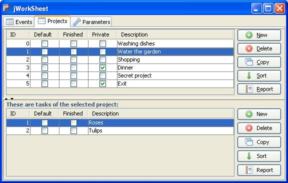
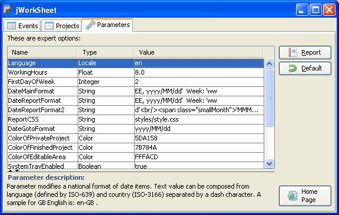

# jWorkSheet

**jWorkSheet** is an open source personal desktop time tracker for your projects,
data are presented in a spreadsheet like format.
Application offers some completed work sheet reports, however you can create your own user reports by XSL transformations.

### Screenshots

### Links

* Home Page: https://jworksheet.ponec.net/
* Home Page on GigHub: https://pponec.github.io/jworksheet/
* Ujorm framework: https://ujorm.org/
