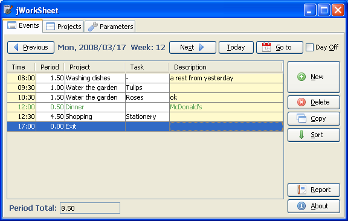

# jWorkSheet

**jWorkSheet** is an open source personal desktop time tracker for your projects,
data are presented in a spreadsheet like format.
Application offers some completed work sheet reports, however you can create your own user reports by XSL transformations.

### Screenshots

See the [link](https://pponec.github.io/jworksheet/screenshots/) for more screenshots.

### Links

* Video tutorial: [JWorkSheet-en.htm](https://pponec.github.io/jworksheet/flash/JWorkSheet-en.htm)
* GitHub Home Page: https://pponec.github.io/jworksheet/
* Original Home Page: https://jworksheet.ponec.net/
* Ujorm framework: https://ujorm.org/
